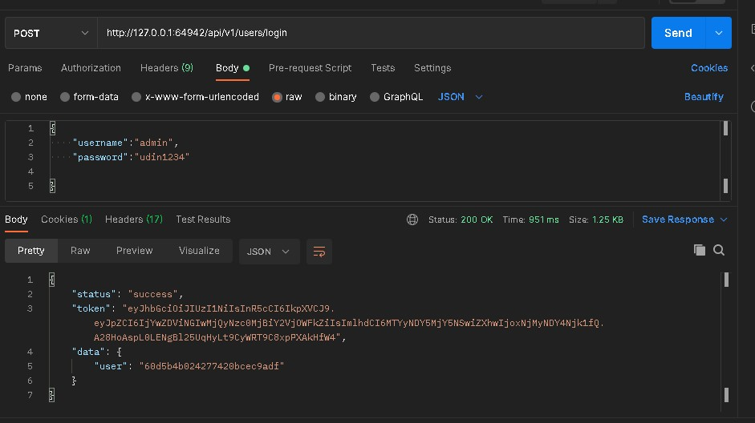

# Sejuta Cita Internship Test
Repo ini dibuat untuk tujuan test internship sejuta cita

## Chart

## Instalasi
Untuk melakukan instalasi dari app ini dapat melakukan langkah langkah sebagai berikut :

**1. Clone repo:**
```bash
git clone https://github.com/dzulfiqar12/SejutaCita_Internship_Test.git
```

**2. Install depedencies yang diperlukan oleh aplikasi:**
```bash
npm install
```

**3. Buat suatu file .env yang berisi :**

|       Variable      |            Value           |
|:-------------------:|:--------------------------:|
|       NODE_ENV      |         development        |
|         PORT        |            3000            |
|       DATABASE      |   `Berisi link database`   |
|  DATABASE_PASSWORD  | `Berisi password database` |
|      JWT_SECRET     |       `Random string`      |
|    JWT_EXPIRES_IN   |             90d            |
| JWT_COOKIES_EXPIRES |             90             |

**4. Jalankan aplikasi :**
```bash
npm start
```


## Dokumentasi
- Dokumentasi Postman : https://documenter.getpostman.com/view/15939003/TzedhjsP
- Live API yang di deploy di heroku dapat diakses disini : https://sejutacita.herokuapp.com/api/v1/users/

## Deploy dengan docker

Untuk melakukan deploy dengan docker dapat melakukan langkah langkah sebagai berikut :

1. Build docker image :
```bash
docker build . -t sejutacita
```

2. Cek docker image yang sudah di build :
```bash
docker images
```

3. Jalankan docker image :
```bash
docker run -it -p 3000:3000 sejutacita
```

4. Stop docker
```bash
docker stop
```

Untuk docker image,sudah saya deploy di docker hub bisa dilihat pada link berikut : https://hub.docker.com/repository/docker/dzulfiqar12/sejutacita

## Scale

Untuk melakukan scaling pada aplikasi ini saya menggunakan minikube untuk menjalankan kubernetes secara local,adapun langkah langkah untuk melakukan scaling menggunakan minikube:

1. Jalankan minikube dengan menggunakan driver docker :
```bash
minikube start --driver=docker
```
2. Setting file .env:
```bash
kubectl create secret generic prod-secrets --from-env-file=.env
```
3. Jalankan script kubernetes:
```bash
kubectl apply -f kubernetes.yml
```
4. Cek service untuk memastikan kubernetes sudah berjalan:
```bash
minikube service
```
6. Cek jumlah pods yang sedang berjalan :
```bash
kubectl get pods --watch
```
7. Melihat url dari aplikasi yang berjalan pada minikube:
```bash
minikube service sc --url
```
8. Menghentikan minikube :
```bash
minikube stop
```

## Credential Admin

| Username  | Password |
|:---------:|:--------:|
|   admin   | udin1234 |

## Bukti Deployment Berhasil

### Docker

1. Build image dan menjalankan docker


2. Push docker ke docker hub


### Kubernetes

1. Menjalankan minikube


2. Setting kubernetes mulai dari .env,menjalankan file yml,dan melihat pods yang berjalan.


3. Melihat url yang nantinya akan digunakan untuk mengakses API.


4. Melakukan request menggunakan url yang sudah didapatkan sebelumnya



